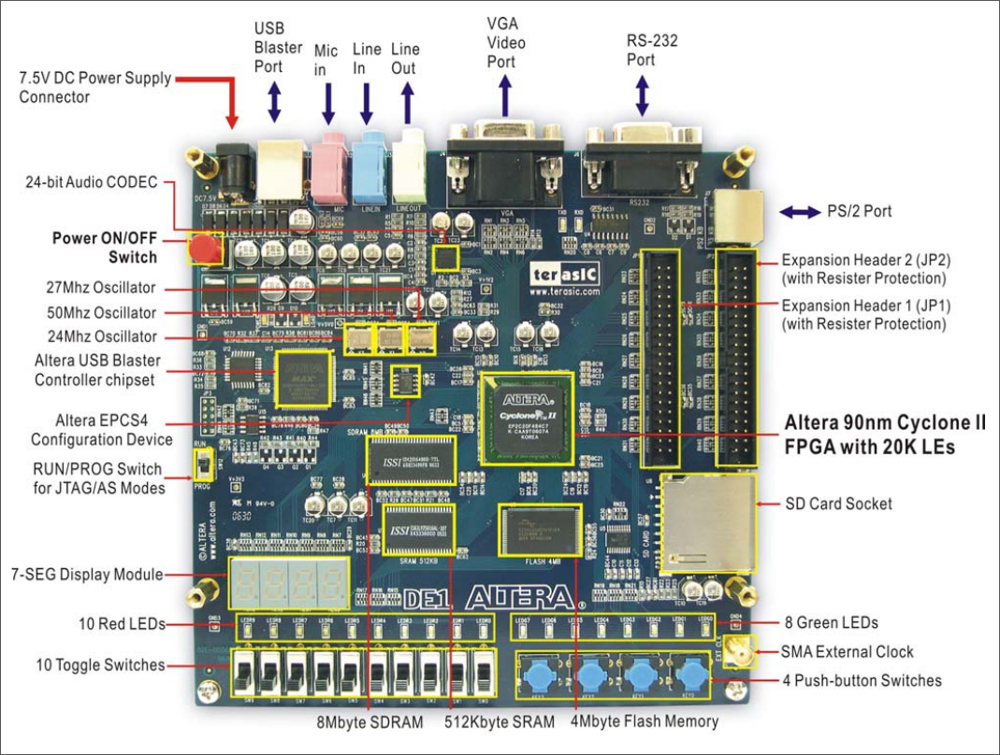

# VHDL Alarm Clock

This project is an implementation of a VHDL design for a simple Alarm Clock on the Altera DE1 Board (Development and Education Board).

<div style="text-align: center">
<a href="./assets/de1-board.png"></a>
</div>

## 🎯 Goal

We were tasked to develop an **alarm clock** on an FPGA.

### Requirements

- The clock must display **hours, minutes, and seconds** of the day.
- The alarm must sound at a **specific programmed time**.
- Both the **alarm time** and the **current time** must be programmable by the user.

### Inputs

- **Alarm/Time switch**: Toggles between displaying the **current time** or the **alarm time**.
- **Alarm Enable/Disable switch**: Turns the alarm on or off.
- **SetHour push button**: Used to set the **hour** (for either the current time or alarm time).
- **SetMinute push button**: Used to set the **minute** (for either the current time or alarm time).

### Outputs

- **Six 7-segment displays**: Show the time in **HH:MM:SS** format (either the current time or the alarm time, depending on the switch).
- **Two LEDs**:
    - One LED indicates if the **alarm is enabled**.
    - The other LED **blinks** when the alarm is ringing.

## 📦 Structure

- **Directories**

    - [**`.vscode`**](./.vscode/) - Project specific VSCode settings (formatting and extensions)
    - [**`rtl`**](./rtl) - VHDL designs and circuits (`.vhd`)
    - [**`tb`**](./doc/) - VHDL test bench files

- **Files**

    - `flake.nix` - Environment configuration (based on
    [**dev-templates**](https://github.com/the-nix-way/dev-templates))
    - `.envrc` - Used by **direnv** to load **Flakes**
    - `flake.lock` - Used by **Flakes** to version packages
    - `Makefile` - Used to automate checks and analyses

## 🔧 Tools

- [VSCodium](https://github.com/VSCodium/vscodium) - Code editor
- [GHDL](https://github.com/ghdl/ghdl) - VHDL 2008/93/87 simulator
- [VUnit](https://github.com/VUnit/vunit) - Testing framework for VHDL
- [NVC](https://github.com/nickg/nvc) - VHDL compiler & simulator
- [GTKWave](https://github.com/gtkwave/gtkwave) - Waveform viewer

## ✈️ Usage

1. All the files under `rtl/` and `tb/` can be imported in your synthesis tool (e.g Quartus or Vivado).
2. Optionally, you can use [GHDL](http://ghdl.free.fr/), which is a cross-platform open-source simulator for VHDL language, to simulate the circuits.
3. Install *GHDL* and *GTKWave* and add them to your `PATH`
4. Simulated results can be viewed using [GTKWave](http://gtkwave.sourceforge.net/) which is an open source waveform viewer.

### 🚀 Simulate

Run `make simulate` to run the project's test bench and display waveform using GTKWave

```bash
$ make simulate
>>> cleaning design...
>>> done...
>>> analyzing designs...
>>> simulating design: tb/tb_counter.vhd
tb/tb_counter.vhd:43:9:@510ns:(assertion note): completed
>>> showing waveform for: tb/tb_counter.vhd

GTKWave Analyzer v3.3.94 (w)1999-2018 BSI
...
```

`100us` stop time is given for simulation by default. Optional `STOPTIME=` argument can be passed to `Makefile` to change this value.

```bash
make simulate STOPTIME=1ms
```

### 🧪 Check & Analyze

Run `make` on the root folder to check syntax and analyze all designs :

```bash
$ make
>>> check syntax on all designs...
>>> analyzing designs...
>>> completed...
```

> [!CAUTION]
> There should be **no errors** if you haven't changed anything.

## 📜 License

This project is licensed under the MIT License - see the [LICENSE](LICENSE) file for details.
